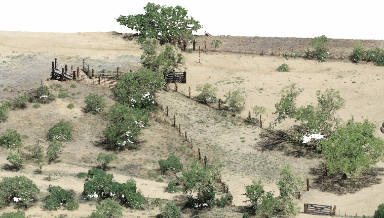
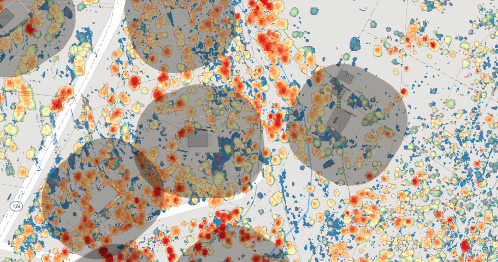
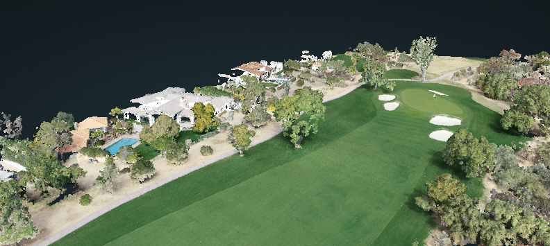
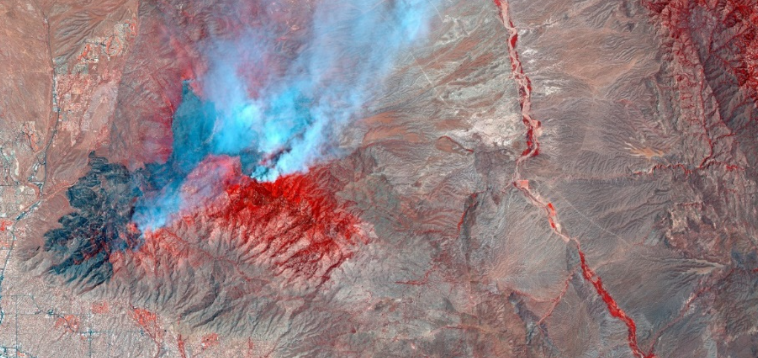

# Drone Imagery Archive

View and download my [entire archive](https://data.geonadir.com/social-profile/55?extent=-14055722.19%2C3597708.43%2C-11227317.52%2C5224300.12) of collected raw drone imagery hosted in [Geonadir](https://geonadir.com/).

  

___

 
 

# Santa Rita Rangeland Monitoring

* Raw drone imagery and imagery products (DEMs, point clouds, orthomosaics) are stored in Cyverse [Data Store](https://datacommons.cyverse.org/browse/iplant/home/shared/commons_repo/curated/Gillan_Ecosphere_2021)
    
* Drone imagery products can be visualized in [Google Earth Engine](https://bit.ly/srer-drone-2019)

 

___

 

# Jemez Residential Fire Risk 2020

* [Interactive Fuel Map](https://promethean-gift.github.io/map) showing trees crowns adjacent to residential houses. Featuring drone-based photogrammetry and Aerial LiDAR. 

* Interactive [Photogrammetric Point Cloud](https://ps2.d2s.org/sharepotree?file_id=6944436e-ba1b-4e71-9c21-3edabfd3fd25) 

 

___

 

# Paradise Valley Country Club 

* Paradise Valley Hole #17 [Point Cloud](https://ps2.d2s.org/sharepotree?file_id=188f6623-c18b-4829-adbb-571ae038e834) and [Orthomosaic](https://ps2.d2s.org/sharemap?file_id=58b23ea8-9efd-4a87-86ad-1f40f8c39f02&symbology=eyJyZWQiOnsiaWR4IjoxLCJtYXgiOjI1NSwibWluIjoxNiwidXNlck1heCI6MjU1LCJ1c2VyTWluIjoxNn0sImJsdWUiOnsiaWR4IjozLCJtYXgiOjI1NSwibWluIjoxNiwidXNlck1heCI6MjU1LCJ1c2VyTWluIjoxNn0sIm1vZGUiOiJtaW5NYXgiLCJncmVlbiI6eyJpZHgiOjIsIm1heCI6MjU1LCJtaW4iOjI2LCJ1c2VyTWF4IjoyNTUsInVzZXJNaW4iOjI2fSwibWVhblN0ZERldiI6Miwib3BhY2l0eSI6MTAwfQ==)

 

___

 

# Bighorn Fire Forest Change 2021-2022
 

* [Interactive 2D Map](https://uagis.maps.arcgis.com/apps/webappviewer/index.html?id=42151e75171b4c7d8b6feab2ee240e59)

* [Interactive Drone Point Cloud of Plot C23](https://ps2.d2s.org/sharepotree?file_id=d8bb3869-583c-4f10-b0b0-9bbfafda732e)

* [Interactive Drone Point Cloud of Loma Linda Canyon](https://ps2.d2s.org/sharepotree?file_id=7b76f7e0-42e7-4143-bd9d-a052d11d5878)
  
* [Final Report](https://data.cyverse.org/dav-anon/iplant/projects/bighorn_fire/Bighorn_Fire_Imagery/Bighorn_Fire_final_report_ARSC.pdf) to Pima County Regional Flood Control District

* All remotely sensed data (drone, aerial lidar, Planet satellite, classifications) can be found [here](https://datacommons.cyverse.org/browse/iplant/home/shared/bighorn_fire) in Cyverse Data Store.

 

___

 

## Santa Cruz River Vegetation Mapping 2022-2023

* [Interactive Drone Point Cloud (April 2022)](https://ps2.d2s.org/sharepotree?file_id=d6056396-4bde-48ae-a745-f5f131f57405)

* [Interactive 2D Classification Map](https://ps2.d2s.org/sharemap?file_id=f1635a4a-7ed9-4398-a99b-c2abc90766c3&symbology=eyJtYXgiOjE0LCJtaW4iOjgsIm1vZGUiOiJtaW5NYXgiLCJ1c2VyTWF4IjoxNCwidXNlck1pbiI6OCwiY29sb3JSYW1wIjoibWFnbWEiLCJtZWFuU3RkRGV2IjoyLCJvcGFjaXR5IjoxMDB9)

* Remotely sensed data products from airplane and drone are [here](https://datacommons.cyverse.org/browse/iplant/home/shared/santa_cruz_river) in Cyverse Data Store

* [Final Report](https://data.cyverse.org/dav-anon/iplant/projects/santa_cruz_river/SCR_drone_report_Gillan_2022.pdf)
 to Pima County Regional Flood Control District

 

___

 

## Tyson's House

[Point Cloud (COPC)](https://viewer.copc.io?state=381c861efb8fc737530a0ab8b2273785b47e0827fef4ac03b0ae5a21ee0ad5f2) of Tyson's house

 
 

## Mt. Bigelow, Az

[Point Cloud (COPC)](https://viewer.copc.io?state=5edf1f75666531bb1262ccf52fd38794f018cf9c1a0efcf0b939ed536d2f83cb) of Mt. Bigelow in the Santa Catalina mountains near Tucson, AZ
