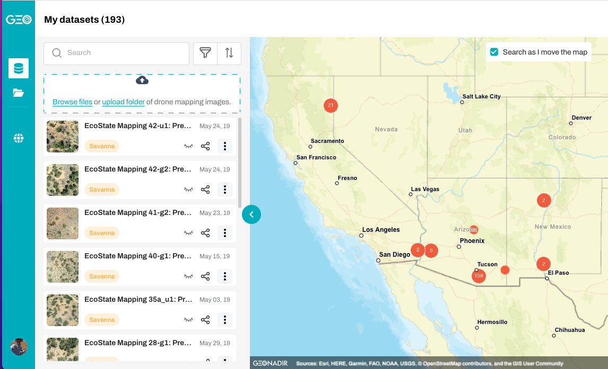

# Raw Drone Imagery

You can view and download my [entire archive](https://data.geonadir.com/social-profile/55?extent=-14055722.19%2C3597708.43%2C-11227317.52%2C5224300.12) of collected drone imagery (2016-present day) from [Geonadir](https://geonadir.com/).

  

___

# Project Data

### Gillan, JK., GE Ponce-Campos, TL Swetnam, A Gorlier, P Heilman, MP McClaran. 2021. Innovations to expand drone data collection and analysis for rangeland monitoring. *Ecosphere 12(7)*. DOI: 10.1002/ecs2.3649

* Raw drone imagery and imagery products (DEMs, point clouds, orthomosaics) are stored in Cyverse [Data Store](https://datacommons.cyverse.org/browse/iplant/home/shared/commons_repo/curated/Gillan_Ecosphere_2021)
    
* Drone imagery can be visualized in [Google Earth Engine](https://bit.ly/srer-drone-2019)

* [SpatioTemporal Asset Catalog (STAC)](https://radiantearth.github.io/stac-browser/#/external/stac.cyverse.org/collections/Santa%20Rita%20Ecostate%20Mapping%20-%20May%202019)

### US Golf Association

* Paradise Valley hole #17 [point cloud](https://viewer.copc.io/?state=ee15e0b9ae036865eaada9f398c2d27de94c2cde71bd92cf117156296bf46ab0)

### Jemez Residential Fire Risk

* Drone-based [Fuel Map](https://promethean-gift.github.io/map)

### Bighorn Fire Forest Change

* All remotely sensed data (drone, aerial lidar, Planet satellite, classifications) can be found [here](https://datacommons.cyverse.org/browse/iplant/home/shared/bighorn_fire) in Cyverse Data Store. 

* All GIS/RS data can be visualized on a map [here](https://uagis.maps.arcgis.com/apps/webappviewer/index.html?id=42151e75171b4c7d8b6feab2ee240e59)

* [Final Report](https://data.cyverse.org/dav-anon/iplant/projects/bighorn_fire/Bighorn_Fire_Imagery/Bighorn_Fire_final_report_ARSC.pdf) to Pima County Regional Flood Control District

### Santa Cruz River Vegetation Mapping

* Remotely sensed data products from airplane and drone are [here](https://datacommons.cyverse.org/browse/iplant/home/shared/santa_cruz_river)

* [Final Report](https://data.cyverse.org/dav-anon/iplant/projects/santa_cruz_river/SCR_drone_report_Gillan_2022.pdf)
 to Pima County Regional Flood Control District
